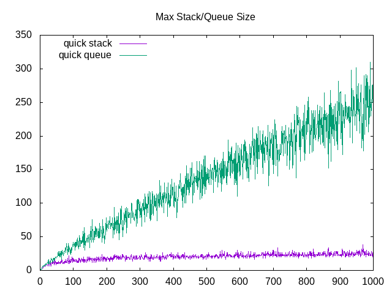
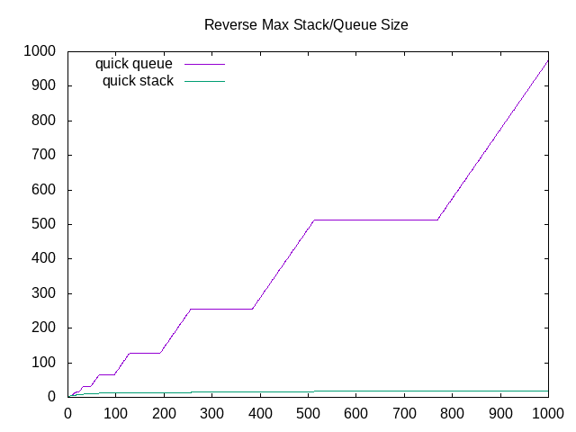
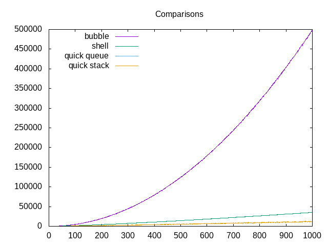
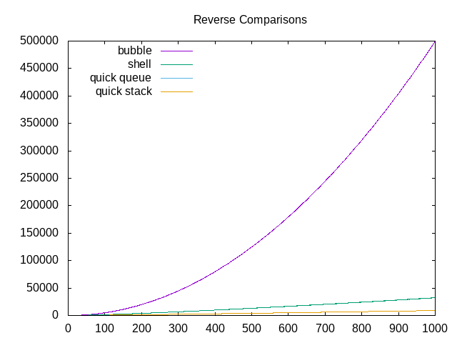
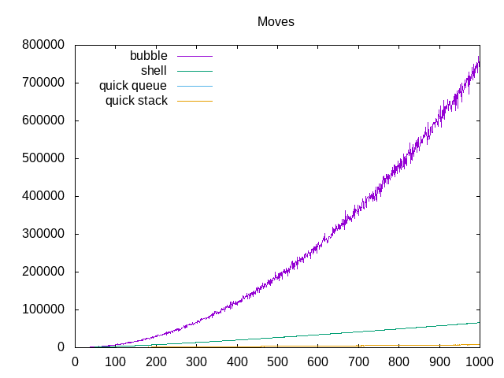
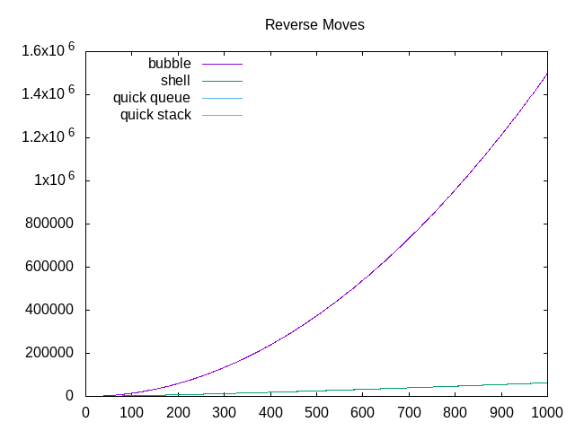

# Assignment 3 Writeup

After completing this assignment, I can definitely say that my understanding of all 3 (could be
consider 4) sorts is definitely a lot stronger than it was before.

## Time Complexity of the different Sorts

### Bubble Sort

>   Bubble Sort has a time Complexity of O(_n^2_). This is quite a bad time complexity, and this is
>   easily seen in the various graphs throughout this document. I think that the constant is
>   negligible as this sort performs worse than all other sorts from nearly the beginning.

### Shell Sort

>   I don't know if I can provide a clear time complexity for this sort. On one hand, it performs
>   slightly worse than quick sort, and yet much better than bubble sort. From examining the
>   algorithm, I am not able to determine the correct time complexity. The best I can do is say that
>   it is bounded between O(_n * log n_) and O(_n^2_).

### Quick Sort

>   I will be covering both the queue and stack implementations of this algorithm as they perform
>   identically in terms of iterations. Looking at the graphs, the complexity looks nearly
>   logarithmic, and indeed, the time complexity is O(_n * log n_). I believe that the constant is
>   negligible in this case as it seems to be fastest since the very beginning.

### What I Learned

>   While programming these sorting algorithms, I learned what I think is an important lesson. First
>   of all, I feel that the programming of the different sorts was in fact the easiest part of this
>   lab. What was really the hard part was programming the supporting code, such as the queue and
>   the stack. Since the pseudocode for all the sorts was given, coding up these was rather trivial.

### Sort Experimentation

>   Personally, I did not do much experimenting with the various sorts. I think that the majority of
>   the experimenting that I did was while I was producing the data necessary to create the graphs
>   for this writeup.

### Stack and Queue Size

>   \
>   \
>
>   This part of the data analysis was very interesting for me as there were some unexpected
>   results. First of all, stacks seem like an obvious choice for any given situation. I am not
>   quite sure why the size of stacks seems to be so useful for this problem. Perhaps because we are
>   using a stack instead of recursive calls to solve this problem, the stack is being utilized as
>   a stack of function calls, and thus fits most naturally with this problem. I can say
>   definitively that the maximum ize of the queue is relative to the number of elements in the
>   array. It seems like linear growth to me, although I cannot know for sure. Stacks on the other
>   hand, seem to remain relatively stable in their maximum size. I am not sure if this behavior
>   would continue as the size of the input grows, but I suspect it will.\
>
>   I found the maximum stack and queue sizes for a reverse sorted list to be very interesting.
>   As the graph shows, the maximum queue size shows strange, almost fractal-like behavior. As the
>   size of the input grows, the maximum queue size finds longer periods of stability and periods
>   of growth, alternating between the two. I am not sure how this behavior came to be.

#### Graphs

>   \
>   \
>
>   Above are the graphs of the number of comparisons between the four sorts with randomly generated
>   lists, and reverse sorted lists. Both graphs are essentially identical, with slight variation.
>   As the graphs show, bubble sort is considerably worse than all the other sorts, and shell sort
>   is only slightly worse than quick sort. Both quick queue and quick stack have identical behavior
>   as the are only slightly different implementations of the same algorithm.
>
>   \
>   \
>
>   Above are the graphs of the number of moves between the four sorts with randomly generated lists,
>   and reverse sorted lists. Like the comparisons, there is very little differences between these
>   two lists. However, there is one noticable difference. It seems like quick sort is not present
>   on the graph of the reverse sorted lists moves. However, this is simply due to the fact that
>   this just so happens to be one of the best cases for this particular implementation of
>   quicksort. Since the inital pivot is chosen to be the middle elment of the array, Every
>   partition of the array will result in each side having an equal number of elements. This results
>   in a best case scenario for quicksort, where very few moves need to be done. This is why the
>   the moves for this sort do not appear on the graph.
