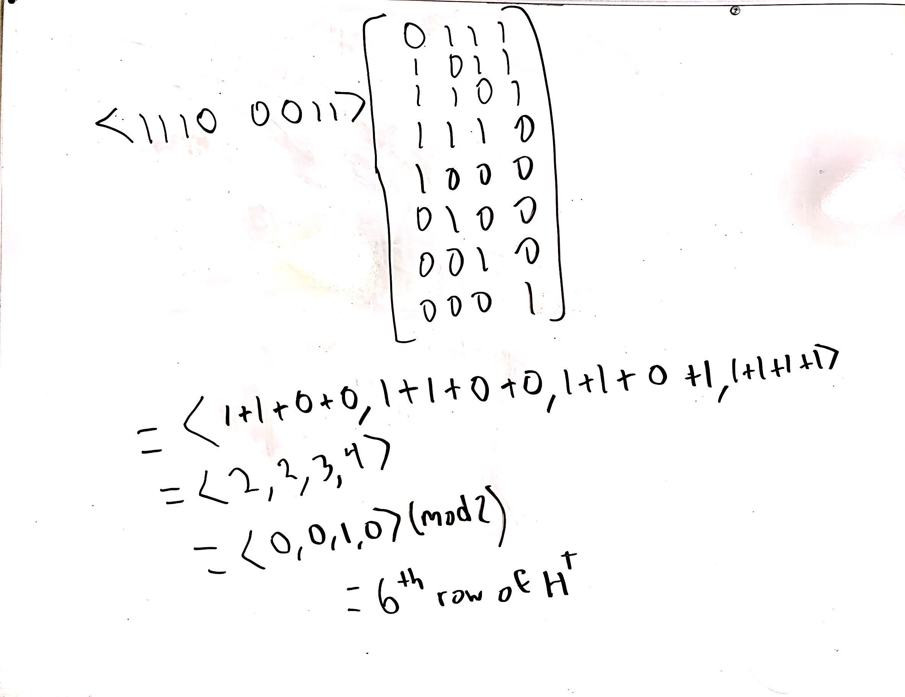
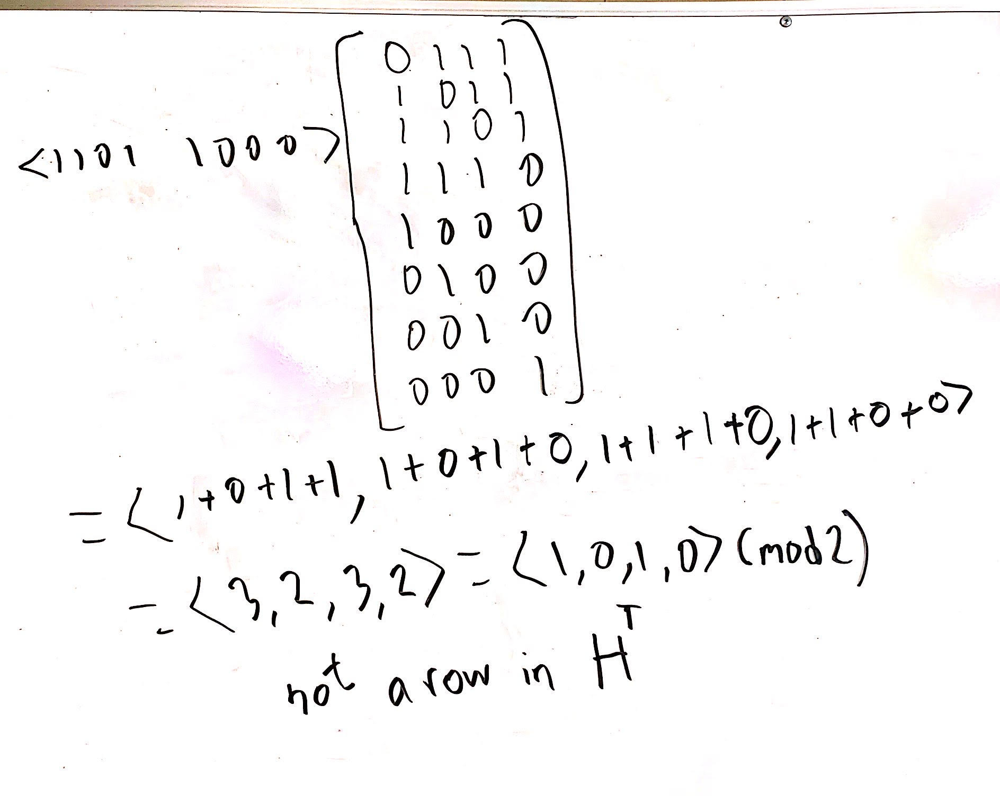

### Assignment 5 Design Document

The purpose of this program is to provide the ability to encode a file using Hamming encoding, as well
as to decode the resulting encoded data. This encoding makes the resulting encoded data resistant to
bit flips, to a certain degree. Noise can be artificially injected into the input data using the
provided error-injection program. The amount of entropy in a file can also be found using the
supplied entropy-measure program.

## Pre-lab Questions

# 1. Complete the rest of the look-up table shown below.

> I will be modifying the 0th entry in this table for consistency.
>
>   0 | 0000 = HAM_OK\
>   1 | 0001 = 7\
>   2 | 0010 = 6\
>   3 | 0011 = HAM_ERROR\
>   4 | 0100 = 5\
>   5 | 0101 = HAM_ERROR\
>   6 | 0110 = HAM_ERROR\
>   7 | 0111 = 0\
>   8 | 1000 = 4\
>   9 | 1001 = HAM_ERROR\
>   10| 1010 = HAM_ERROR\
>   11| 1011 = 1\
>   12| 1100 = HAM_ERROR\
>   13| 1101 = 2\
>   14| 1110 = 3\
>   15| 1111 = HAM_ERROR\

# 2. Decode the following codes. If it contains an error, show and explain how to correct it. Remember, it is possible for a code to be uncorrectable.

(a) 1110 0011 (base 2)\
First we multiply this by the transpose of the parity-checker matrix.\

The error syndrome is equal to the 6th row of the transposed parity-checker matrix, meaning the 6th
bit was flipped. Since the error bit is in the upper nibble of the message vector, this means that a
parity bit was flipped, not one of the message bits. Therefore, the message was preserved and the
message is 1110.\

(b) 1101 1000 (base 2)\
First we multiply this by the transpose of the parity-checker matrix.\

The error syndrome is not equal to any of the rows in the transposed parity-checker matrix, nor is
it equal to __0__. This means that more than one bit was flipped, and the message is uncorrectable.

## Assignment Pseudocode

I will go over the basic pseudocode for this assignment, for both the encoder and the decoder. I
believe that the implementations of Bit Vector and Bit Matrix are laid out pretty nicely within the
assignment PDF and do not require further description here.

```
Encoder

main():
    input = getInputFileFromUserLocation()
    output = encode(input)
    output.permissions = input.permissions
    sendOutputToUserLocation()

encode(input):
    bits = bitStream(input)
    output = emptyBitList
    for(nibble n in bits):
        byte b = hammingEncode(n)
        output.add(b)
    return output

hammingEncode(nib):
    byte output = matrixMult(nib, parityMatrix)
    return output

Decoder

main():
    input = getInputFileFromUserLocation()
    output = decode(input)
    output.permissions = input.permissions
    sendOutputToUserLocation()
    if(verbose):
        printStatistics()

decode(input):
    bits = bitStream(input)
    output = emptyBitList
    while(bits.hasMoreBits()):
        byte b = bits.nextBit()
        nibble lower = hammingDecode(b)
        b = bits.nextBit()
        nibble upper = hammingDecode(b)
        byte total = join(lower,upper)
        output.add(total)
    return output

hammingDecode(byte b):
    errorSyndrome = matrixMult(b, transposedParityMatrix)
    result = lowerNibble(b)
    look = lookUpTable[errorSyndromeToInt]
    if(look== 0 || look == HAM_ERROR):
        return result
    flipBit(result, look)
    return result


```
