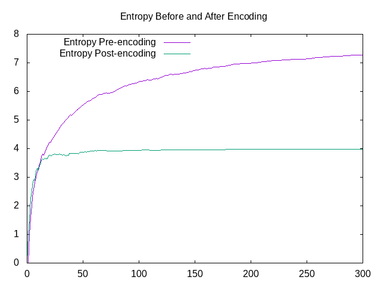
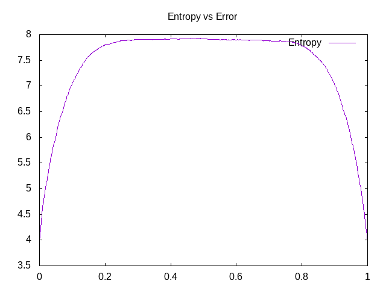

# Assignment 5 Writeup

## First Thoughts

After completing this assignment, I can say that this assignment was most likely the one where I
truly felt that I had a solid grasp of the C programming language. Segmentation faults, a problem
that plagued every assignment that I had completed up until this point, were nowhere to be seen
throughout my entire coding process. Issues that I had faced before with understanding about
pointers where also no longer present. I feel that my implementation of this assignment would not
have been possible had this assignment been one of the first assignments.

## Stdin and Stdout

Before this assignment, I did not have a proper grasp of what stdin and stdout were. Informally, I
had always known what the console was, and how users could input data to the console as well, but I
never realized that stdout could be used an input to another command and allow for such eloquent
commands. Furthermore, this lab also significantly improved my understanding and appreciation for
how the pipe operator works in the UNIX command line. commands like the following:\

```
$ echo "This is a test" | ./encode | error -e .05 -s 2021 | ./decode -v
```

would not have made any sense to me in the past, but now have a certain beauty to them.

## Entropy and Related Graphs

Prior to reading about entropy for this assignment, my understanding of what entropy is came mainly
from my high school physics class, as a way to measure the overall energy in a closed system.
Knowing this, I can understand why the Computer Science related entropy is named so because it is
a similar concept. From what I understand, Data Science entropy is a metric to measure the amount of
meaningful data within a larger set of data. I have created two graphs that I believe show how the
process of Hamming Encoding changes entropy of data as well as how error-injection changes the
entropy of a file.



In this graph, a file is generated that is made up of _x_ random bytes. The entropy of both the raw
file as well as the file post encoding is graphed. The first thing to notice here is that both
quickly hit a horizontal asymptote, showing what the limit entropy is for an arbitrarily large file,
both encoded and unencoded. In this case the entropy of a random data file is ~ 8, while the entropy
of an encoded random data file is ~ 4. For the sake of brevity, I have cut off this graph as it takes
quite a while for the unencoded file to reach numbers that adequately show that it does in fact approach
an asymptote at y = 8 .  These numbers seem somewhat arbitrary at first, but the key
fact is that the encoded file has, on average, half the entropy as the unencoded file. This is why I
think this is the case: A file made up of random bytes will have no pattern to it, and thus every
byte that you recieve from this file will be important, as you cannot ascertain any sort of pattern
from the bytes that you have already recieved. This will give you a base entropy of 8, an arbitrary
number that arises for reasons that I do not know, perhaps due to their being 8 bits to a byte, but
that is simply a shot in the dark on my part. However, when one encodes this random file, they
are effectively creating a new file with twice the number of bytes, but with still the original
amount of information. What this does is essential halves the entropy as half of the information in
the resulting file is "redundant".\
With this information, I hypothesize that any sequence of bytes will have an entropy that is double
the entropy of that same file after it is encoded, on average. I am not quite sure how to arbitrary
generate data that has a chosen entropy in order to test this hypothesis, but I certainly wish I could.



This resulting graph is somewhat less related to this assignment, but I believe that it is
interesting nonetheless. This graph shows the entropy of encoded file that has errors injected into
it, ranging from an error rate of 0 to 1. When I was gathering the data, to create this graph, the
results were not what I was expecting. First let us consider when the error rate equals 0. Referring
to our first graph, we can see that an encoded file made up random bytes will have an entropy of ~ 4,
so this is no surprise. Now we can consider the graph as the error rate moves from 0 to .5. As we
begin to introduce more and more errors into our file, we can reasonably say that we are removing
some of the deterministic aspect of this encoded file. Prior to the error-injection, half of this
files content was entirely dependent on the other half. Now when we begin to introduce errors, some
of these dependent bits will become simply random bits, creating "new" information. Finally, what I
consider to be the most interesting part of this graph is the latter half. Here, we see that entropy
is actually decreasing, and decreasing down to a point where it is as if no errors were injected at all.
A key realization to make at this point is that once our error rate hits 1, we have created a
completely deterministic process. We are flipping every bit, which is not introducing any new
information at all. Consequently, if we are to flip, say .8 of all bits, than in terms of new
information, we are effectively flipping only .2 of all bits as deterministically flipping bits does
not add new information. Therefore, it is obvious that our maximum entropy will be when we are flipping
half the bits.\
I found all of this information very interesting and exciting to gather, and I hope that my
explanation/inferences about why this graph was produced were coherent.

