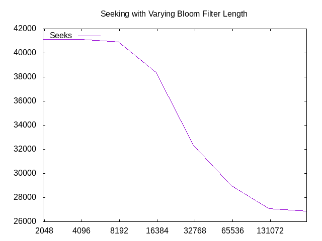
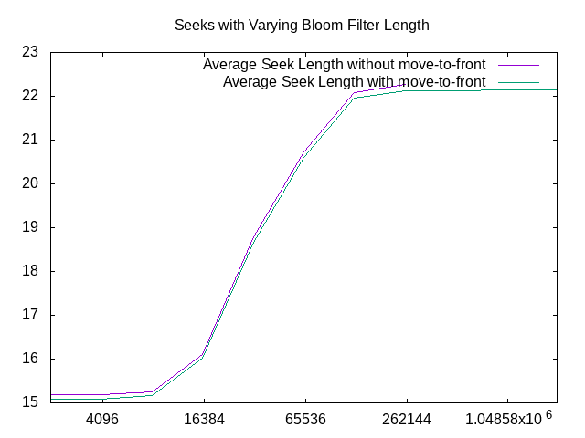
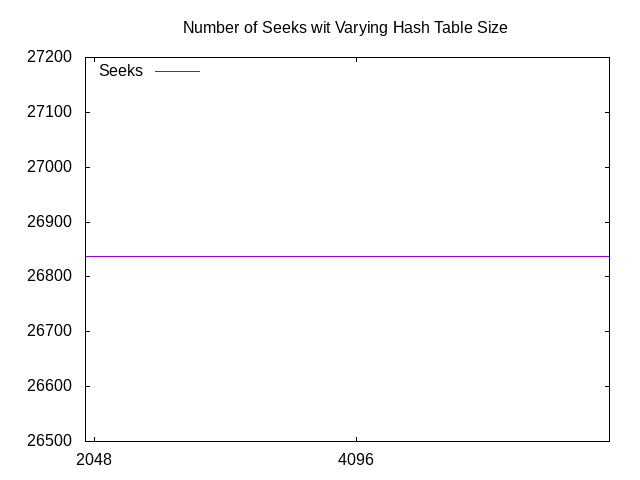
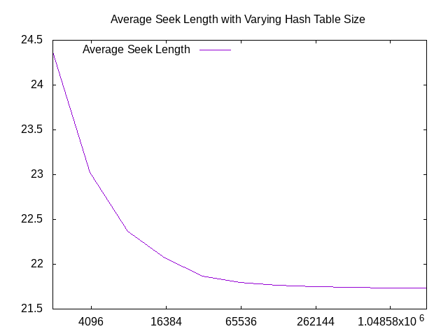

### Assignment 7 Writeup

After completing that assignment, I am pleasantly surprised at how nice it is to
work with LinkedLists. Once I had handled the nitty gritty functions like
insertion, I feel like it was a pleasant experience overall. However, this ease
of access comes with one big flaw, and that is the fact that LinkedLists do not
have random access. As a result, retrieving an element from the list takes O(n),
as opposed to O(1). I have produced several graphs that I believe go over some
interesting information for this assignment. All of these graphs have a
logarithmic scale for the x axis for readability.

## Seeks and Varying Bloom Filter Length

Seeking is a very important operation for this assignment as this is how the
HashTable communicates with a LinkedList in order to retrieve a specific Node.
As the seeking operation is somewhat costly, we want to ensure that we minimize
how often it occurs.

\

In this graph, you can see that a rather simple trend, as the Bloom Filter
length increases, the number of seeks that are performed decreases. This is
simply because as we increase thet number of possible spots in the Bloom Filter,
we are reducing the possibility for a hash collision. This results in smaller
LinkedLists and less calls to seek.

## Average Seek Length and Varying Bloom Filter Length

\

This graph is slightly more interesting than the previous graph as not only does
it show the average seek length, but it also shows the same graph but with the
move-to-front rule enabled. Let's tackle each part seperately. First off, you
may be wondering why the average seek length is going up as we increase the
length of the bloom filter. To be completely honest, I am not sure myself why
this is the case. If I were to try to reasonably infer why this is happening, I
would have to say that this is most likely a result of a tradeoff with the
number of seeks, as the number of seeks decreases, the length of the average
seek increases. As for the second part of this graph, what I would like to point
out is how the move-to-front rule has an impact on the number of seeks, or to be
more precise, how it does not. True, the move-to-front rule does have an impact,
but it seems to very negligible and it also seems to be a constant. It seems
like the move-to-front rule is not the best form of optimization for this
particular problem.

## Seeks and Varying Hash Table Size

\

This is a rather uneventful graph, but I think that it is important nonetheless.
What this graph shows is that the size of the hash table has no impact on the
number of seeks that are performed. I believe that this is due that the number
of words that will be stored in the hash table does not change based on how big
the hash table is. This means that the number of times that a word is checked in
the hash table is dependent on the number of words in stdin, not on the size of
the hash table.

## Average Seek Length and Varying Hash Table Size

\

This final graph is very interesting in my opinion because it shows behavior
that would not be expected if one was comparing this graph to the second graph
of this document. In the second graph, the average seek length actually rose as
the bloom filter length went up. In this graph however, the opposite is true,
the average seek length went down the hash table size went up. I believe that
this is due to the fact that a larger hash table reduces the likelyhood of a
hash collision, and therefore there are less linked lists that are particularly
long. This means that you do not need to look too far into each linked list in
order to find a particular element.

## Conclusions

After producing all of these graphs, I can conclude what many others have
concluded in the past: it is more efficient to allocate more memory for the
bloom filter and the hash table, but the tradeoff is how much space this ends up
taking up. As with many computer science problems, a balance needs to be found
between computational complexity and storage complexity. I may not know what
that balance may be, but I believe that the graphs that I have included would be
helpful in determining that information.
